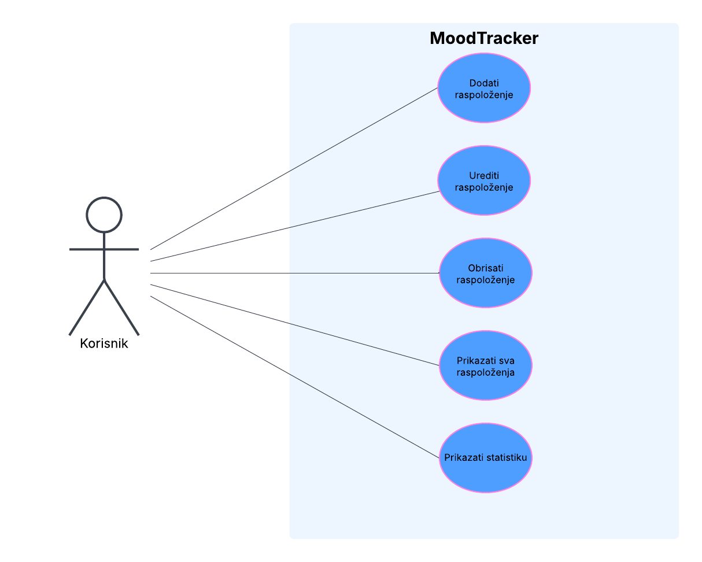

# MoodTracker

**MoodTracker** je intuitivna i jednostavna aplikacija namijenjena svima koji žele pratiti svoje raspoloženje kroz vrijeme. Bilo da želiš bolje razumjeti sebe, uočiti obrasce ponašanja ili samo voditi dnevnik emocija — MoodTracker ti omogućuje sve to na jednom mjestu.

Putem jednostavnog i preglednog sučelja, korisnik može unositi svoje svakodnevno raspoloženje kao brojčanu ocjenu (od 1 do 10), dodati kratak opis, te kasnije uređivati ili brisati te unose. Aplikacija automatski generira pregledni graf pomoću kojeg možeš vizualno pratiti kako se tvoje raspoloženje mijenjalo kroz vrijeme.

MoodTracker ne koristi nikakve vanjske servise i sve podatke sprema lokalno, čime osigurava privatnost i potpunu kontrolu nad tvojim unosima.

---

## Što sve MoodTracker nudi?

- Jednostavno **dodavanje** svakodnevnih unosa
- Pregled unosa u **tabličnom prikazu**
- **Uređivanje** postojećih zapisa uz automatsko popunjavanje forme
- **Brisanje** zapisa koji ti više ne trebaju
- Grafički prikaz promjena raspoloženja uz **Chart.js**
- Pregledno i responzivno sučelje uz **Bootstrap**
- Sve pokrenuto unutar vlastitog **Docker** container-a
- Podaci se spremaju u **SQLite bazu**

---

## Use case dijagram



---

## Instalacija i pokretanje aplikacije

```bash
1. Kloniraj repozitorij
git clone https://github.com/<tvoje-korisnicko-ime>/MoodTracker.git
cd MoodTracker

2. Buildaj Docker image
docker build -t moodtracker .

3. Pokreni aplikaciju
docker run -p 5000:5000 moodtracker

4. Otvori preglednik i idi na:
http://localhost:5000
```
